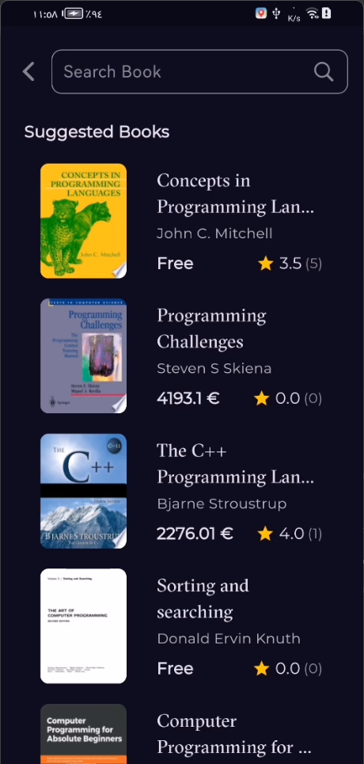

<div align="center">

# *"وَقُلْ رَبِّ زِدْنِي عِلْمًا"*

</div>
<br clear="both">
<a href="https://git.io/typing-svg"></a>
<br clear="both">

## Overview

Bookly is a Flutter-based mobile application designed for book enthusiasts. It provides users with access to a wide range of books, categorized by genres such as Programming, Science, Health, and more. The app includes features like a splash screen with animations, home and detail views for books, and a robust search functionality to help users find their favorite books.

[](https://flutter.dev/)
[](https://opensource.org/licenses/MIT)

---

## Features

1. **Splash Screen**  
   - Animations for the logo and text.
   - Automatic navigation to the home screen after a short delay.

2. **Home Screen**  
   - Displays featured books and newest books by categories.
   - Includes a tab bar for easy navigation between categories.

3. **Book Details Screen**  
   - Provides detailed information about a selected book.
   - Displays similar books based on the book's category.

4. **Search Functionality**  
   - Allows users to search for books using a search bar.
   - Displays search results with pagination and loading indicators.

5. **Bloc State Management**  
   - Uses `flutter_bloc` for efficient state management.
   - Separate Cubits handle fetching data for featured books, newest books, and search results.

---

## Screenshots

| Splash Screen | Loading Books Screen | View Books Screen |
|---|---|---|
|  |  |   |

| Default Search Screen | Search Books Screen | Details Books Screen |
|---|---|---|
|  |  |   |

---


## Installation

1. Clone the repository:
   ```bash
   git clone https://github.com/yourusername/bookly.git
   ```
2. Navigate to the project directory:
   ```bash
   cd bookly
   ```
3. Install dependencies:
   ```bash
   flutter pub get
   ```
4. Run the app:
   ```bash
   flutter run
   ```

---

## Project Structure

```
lib/
├── core/
│   ├── routers/
│   │   └── routers_manager.dart  # Manages app routes
│   ├── theme/
│   │   └── theming_app.dart      # Contains app themes
│   ├── utils/
│   │   └── service_locator.dart # Dependency injection
│   ├── widgets/
│       └── reusable_widgets.dart # Reusable UI components
├── features/
│   ├── home/
│   │   ├── data/
│   │   │   └── repo/ # Home repository implementation
│   │   ├── presentation/
│   │       ├── view/ # UI for home-related screens
│   │       └── view model/ # Bloc Cubits for home features
│   ├── splash/ # Splash screen features
│   ├── search/ # Search functionality
└── main.dart # App entry point
```

---

## How It Works

### **Splash Screen**
- Animates logo and text using `AnimationController` and `Tween`.
- Navigates to the home screen after 3 seconds.

### **Home Screen**
- Fetches featured and newest books using `FeatureBooksCubit` and `NewestBooksCubit`.
- Displays categories with `TabBar` and a scrollable list of books.

### **Book Details**
- Accepts a `BookModel` object and displays its details.
- Fetches similar books using the `SimilarBooksCubit`.

### **Search Screen**
- Includes a text field for user input.
- Uses `BuilderSearchBooks` to fetch and display results.

---

## Dependencies

- **flutter_bloc**: State management
- **go_router**: Navigation and routing
- **http**: API calls and data fetching

---

## Contributing

Contributions are welcome! Feel free to submit a Pull Request with improvements, bug fixes, or new features.

1. Fork the repository.
2. Create a new branch (`git checkout -b feature/my-feature`).
3. Make your changes and commit (`git commit -am 'Add new feature'`).
4. Push to the branch (`git push origin feature/my-feature`).
5. Create a new Pull Request.

## Congratulations

You’ve successfully integrated Bookly App into your Flutter app! For more advanced features and customization options.

If you found this guide helpful, don’t forget to ⭐ star this repository on GitHub to show your support!

Thank you for reading!

## Contact

For any questions or inquiries, feel free to reach out:

- **GitHub:** [mohamedmagdy2301](https://github.com/mohamedmagdy2301)
- **Email:** [mohammedmego15@gmail.com](mohammedmego15@gmail.com)

## License

This project is licensed under the MIT License - see the [LICENSE](LICENSE) file for details.
